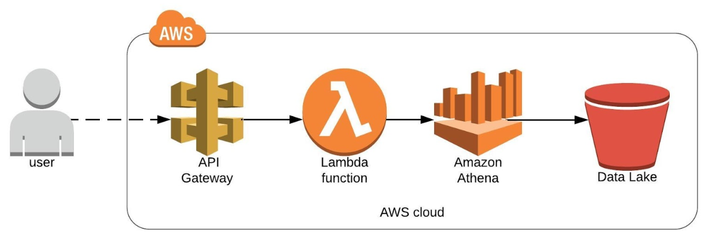

# AWS - Data Lake API Sample

This project is an example of how to use the Serverless Framework to deploy a serverless architecture on AWS.
The goal is to upload sample data to S3 and build a simple infrastructure to expose it through API gateway endpoints.

## Table of Contents
[Architecture](#architecture)  
[Requirements](#requirements)  
[Deployment](#deployment)
<a name="architecture"/>
## Architecture

**Important:** This example was made for people that want to learn how to use the Serverless Framework to deploy a serverless architecture. It means that the focus is to touch multiple services rather then provide a performant and production ready solution. Querying a high latency service like Athena for every call to your endpoint is not recommended for production environments.

With the above in mind, please see the following image to understand the proposed architecture:

What is deployed as part of this service:

- Lambda Functions
- Lambda Layer
- Glue Database
- Glue Tables
- S3 Bucket + Data Upload
- API Gateway Endpoints
<a name="requirements"/>
## Requirements 

- [Node.js and NPM](https://www.npmjs.com/get-npm) 

NPM is a package manager and is used to install the Serverless Framework and required plugins.

- [Serverless Framework](https://serverless.com/framework/docs/getting-started/) 
- [AWS CLI](https://docs.aws.amazon.com/cli/latest/userguide/cli-chap-welcome.html) 

The AWS CLI is an open source tool that enables you to interact with AWS services using commands in your command-line shell. It stores a valid **aws profile** on your computer and allows the Serverless Framework to Interact with your AWS account.
<a name="deployment"/>
## Deployment

I recommend using [Visual Studio Code](https://code.visualstudio.com/) as your code editor. Besides doing a great job from the development perspective it also offers a powershell terminal to deploy the service.

All the following commands are run on Visual Studio Code's terminal window.

### 1 - Preparation

The **datalake-api-sample** service uses two serverless plugins.

*serverless-s3-sync*: used to upload the sample data to s3

`npm install --save serverless-s3-sync` 

*serverless-s3-remover*: used when removing the service to get rid of queries stored on the queries bucket.

`npm install serverless-s3-remover`

### 2 - Deploying/Removing the Service

Parameters:  
*AWS Account ID*: used to make sure your global objects (like s3 buckets) are unique.   
*AWS Profile*: generated through the AWS Cli, used to connect to the AWS account

Run the following from your service directory

`serverless deploy --account [AWS Account ID] --aws-profile [AWS Profile]`  
`serverless remove --account [AWS Account ID] --aws-profile [AWS Profile]`

### 3 - Testing the service

To test if the service has been deployed correctly click on the API Endpoints shown as part of the service creation output.

